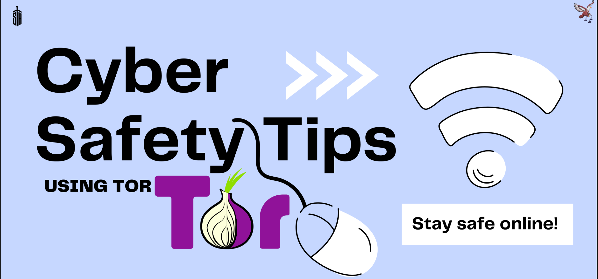

# Tor Script

After a Cyber Security Awareness Training for company X, I thought about sharing the idea and even the script used to make it easier and available for everyone.



### Before doign anything, you can check here some Tor uses/users statistics 05/2021 


* By Users : 


* By Country : 


* By Relays : 


* By Relays : 


## Starting with docker 

So, here we'll use a docker image with Tor installed on it. We

# Docker 

On docker I'm going to use alpine instead of Debian on docker for it's light weight.

## Configuring the image

starting with tor config file `torrc` / (`/etc/tor/torrc`)
```
    VirtualAddrNetwork 0.0.0.0/10
    AutomapHostsOnResolve 1
    DNSPort 0.0.0.0:53530
    SocksPort 0.0.0.0:9050
```
> you can change port 1962 to your own


and now the `Dockerfile`

```
FROM alpine:latest
RUN apk update && apk add tor
COPY torrc /etc/tor/torrc
RUN chown -R tor /etc/tor
USER tor
ENTRYPOINT ["tor"]
CMD ["-f", "/etc/tor/torrc"]
```


* The containing of the folder should be :


Now let's build and image : `docker build -t sofiane/tor .`


Check the image `docker image ls | grep sofiane/tor


## Using the proxy

Start by running the docker image `docker run --rm --detach --name tor --publish 1962:1962 sofiane/tor`


Now let's test it out!

* Without Proxy : My Real IP 

* With Proxy : a Tor exit


You can check with tor website too : 
`curl --socks5 localhost:9050 --socks5-hostname localhost:9050 -s https://check.torproject.org/ | cat | grep -m 1 Congratulations | xargs`


## Using the VPN

We won't use the VPN on a docker, because first we need to create the `tun` device on the container which is a kill for the Security.

So to setup as a vpn, we'll use a Linux VPS ( Debian )

For the VPN, you will always use the same Tor config file!

But, you'll need to make some changes to the iptables rules.

> these rules are for the transparently, what we call `Transparent Routing Traffic Through Tor`

> Check Tor website explaining this in details : [TransparentProxy
](https://gitlab.torproject.org/legacy/trac/-/wikis/doc/TransparentProxy#WARNING)


First of all, add these 3 Environment variables

And the iptables rules :

